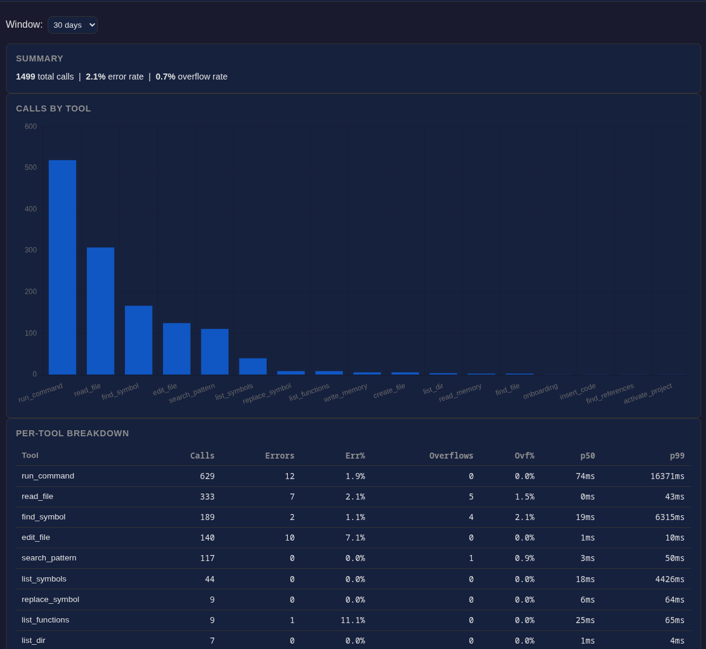

# code-explorer

Rust MCP server giving LLMs IDE-grade code intelligence — symbol navigation, semantic search, git blame, shell integration, and persistent memory. Built for [Claude Code](https://code.claude.com/).



**What sets it apart:**

- **Output Buffers** — large command output is stored in a buffer, not dumped into context. The AI queries it with Unix tools (`grep @cmd_id`, `sed @cmd_id`), keeping the context window lean while making exploration visible and reviewable in Claude Code's UI.
- **Shell integration** — `run_command` executes any shell command from the project root with safety guardrails, stderr capture, and full Output Buffer support for large results.
- **Symbol-level editing** — `replace_symbol`, `insert_code`, `rename_symbol` operate on named code symbols via LSP, not fragile line ranges.
- **Progressive disclosure** — every tool defaults to compact output; `detail_level: "full"` + pagination unlocks everything. No accidental context floods.

## The Problem

LLMs waste most of their context window on code navigation. `grep` returns walls of text. `cat` dumps entire files when you need one function. There's no way to ask "who calls this?" or "what changed here last?" — the tools are blind to code structure.

The result: shallow understanding, hallucinated edits, constant human course-correction.

## The Solution

code-explorer is an MCP server that gives your AI coding agent the same navigation tools a human developer uses in an IDE — but optimized for token efficiency.

**Four pillars:**

| Pillar | What it does | Tools |
|---|---|---|
| LSP Navigation | Go-to-definition, hover, find references, rename — via real language servers | 8 tools, 9 languages |
| Semantic Search | Find code by concept, not just text match — via embeddings | 3 tools |
| Git Integration | Blame — context no other tool provides | 1 tool |
| Persistent Memory | Remember project knowledge across sessions | 4 tools |

Plus file operations (6 tools), AST analysis (2 tools), workflow & config (4 tools), library navigation (2 tools), and usage statistics (1 tool) — **31 tools total**.

**Recent additions:**
- **`goto_definition` + `hover`** — LSP-backed jump-to-definition and type/doc inspection. `goto_definition` auto-discovers and registers library source when the definition lives outside the project root.
- **`get_usage_stats`** — per-tool call counts, error rates, overflow rates, and p50/p99 latency over configurable time windows (1h / 24h / 7d / 30d).
- **Dashboard** — `code-explorer dashboard --project .` launches a local web UI (default port 8099) with tool usage charts and project health views.
- **Library Search** — navigate third-party dependency source code via LSP-inferred discovery, symbol navigation, and semantic search. Libraries auto-register when `goto_definition` returns paths outside the project root.
- **Incremental Index Rebuilding** — smart change detection for the embedding index. Uses git diff → mtime → SHA-256 fallback chain to skip unchanged files, with staleness warnings when the index falls behind HEAD.
- **Semantic Drift Detection** — detects *how much* code changed in meaning after re-indexing, not just that bytes changed. Surfaced via `index_status(threshold)`. Opt out with `drift_detection_enabled = false` in `[embeddings]`.

## Routing Plugin

The MCP server gives Claude the tools, but subagents start with a blank slate and fall back to `Read`/`Grep`/`Bash` by default. The companion `code-explorer-routing` plugin closes this: it injects guidance into every agent and subagent via Claude Code hooks, hard-blocks native file-read patterns before they execute, auto-reindexes in the background, and enforces worktree safety.

→ [Full details: Routing Plugin](docs/manual/src/concepts/routing-plugin.md)

## Output Buffers

Large command output and file reads are stored in a buffer and returned as `@id` handles rather than dumped into context. The AI queries them with Unix tools: `run_command("grep FAILED @cmd_a1b2c3")`, `run_command("sed -n '42,80p' @file_abc456")`. Each query appears as a distinct tool call in Claude Code's UI, keeping exploration visible and the context window lean.

→ [Full details: Output Buffers](docs/manual/src/concepts/output-buffers.md)

## Shell Integration

`run_command` executes any shell command from the project root with stderr capture, Output Buffer support, and safety guardrails: dangerous commands require explicit acknowledgement, direct source file access via `cat`/`grep` is blocked and redirected to symbol tools, and `cwd` paths are validated against the project root.

→ [Full details: Shell Integration](docs/manual/src/concepts/shell-integration.md)

## Git Worktree Support

`EnterWorktree` moves the shell into a worktree, but the MCP server's project root doesn't follow — write tools silently target the main repo unless you call `activate_project` first. Three layers handle this: a write guard (hard block), a `worktree_hint` advisory on every write response, and `.worktrees/` exclusions from file navigation.

→ [Full details: Git Worktrees](docs/manual/src/concepts/worktrees.md)

## Platform Support

Tested on **Linux**. macOS and Windows may work but have not been verified. Contributions welcome.

## Tested Setup

The behavior described in this README — Claude consistently reaching for the right tool, structured workflows, cross-session memory — was produced with a specific combination of Claude Code plugins running together. Without the full stack, results will vary.

> **The short version:** code-explorer gives Claude the *capability*. The surrounding plugins ensure that capability is actually *used*, consistently, across every session and every subagent.

**Our full stack:**

| Component | Plugin ID | Role |
|---|---|---|
| **code-explorer** | *(this server)* | 31 tools: symbol navigation, semantic search, git, memory |
| **code-explorer-routing** | `code-explorer-routing@sdd-misc-plugins` | Hooks that enforce tool selection — intercepts `grep`/`cat`/`read` in all sessions and subagents and redirects to code-explorer equivalents |
| **superpowers** | `superpowers@superpowers-marketplace` | Skills framework: TDD, systematic debugging, brainstorming, parallel agents, code review |
| **episodic-memory** | `episodic-memory@superpowers-marketplace` | Cross-session memory: Claude searches past conversations semantically before starting any task |
| **hookify** | `hookify@claude-plugins-official` | Hook-based behavior enforcement: codify recurring antipatterns into rules that block them automatically |
| **rust-analyzer-lsp** | `rust-analyzer-lsp@claude-plugins-official` | Rust language server: powers `goto_definition`, `hover`, `find_references` for Rust code |

**Gotchas:**

- **Without `code-explorer-routing`**: Claude has the tools but won't always reach for them. Old habits resurface — especially `grep`, `cat`, and `read` in subagents that start with a blank slate. The routing plugin is what makes the behavior consistent.
- **Without `superpowers`**: Claude works but lacks structured workflows. TDD, systematic debugging, and parallel agent dispatch require the skills framework.
- **Without `episodic-memory`**: Knowledge resets each session. The built-in `write_memory`/`read_memory` tools persist notes within a project, but only episodic-memory lets Claude search past *conversations*.
- **Without `rust-analyzer-lsp`** (or a running `rust-analyzer` daemon): LSP tools (`goto_definition`, `hover`, `find_references`, `find_symbol`) degrade to tree-sitter-only mode for Rust — still useful, but no type resolution or cross-file navigation.

## Installation

> **This is a Claude Code tool.** code-explorer is built for [Claude Code](https://code.claude.com/) and currently requires it as the host agent. Other MCP-capable agents may work but are not tested.

**The easiest way to get started:** clone the repo and let Claude do the installation for you. It has access to the full documentation, your system, and the install scripts — it will handle everything from building the binary to registering the MCP server and installing LSP servers for your languages.

```bash
git clone https://github.com/mareurs/code-explorer.git
cd code-explorer
claude
# Then ask: "Help me install and set up code-explorer"
```

If you prefer to install manually, follow the steps below.

---

code-explorer has two components that work together:

1. **MCP Server** — provides the 31 tools (symbol navigation, semantic search, git, etc.)
2. **Routing Plugin** — ensures Claude always uses the right tool, across all sessions and subagents

**Both are recommended.** The MCP server gives Claude the capability; the plugin ensures
that capability is always used correctly. Without the plugin, Claude will occasionally
fall back to `grep`/`cat`/`read` out of habit — especially in subagents that start with
a blank slate.

### Step 1: Install the MCP server

```bash
cargo install code-explorer
```

Register it globally so it's available in every Claude Code session:

```bash
claude mcp add --global code-explorer -- code-explorer start --project .
```

Or per-project (add to your project's `.mcp.json`):

```bash
claude mcp add code-explorer -- code-explorer start --project /path/to/your/project
```

### Step 2: Install the routing plugin

```bash
claude /plugin install code-explorer-routing@sdd-misc-plugins
```

Or add to your user settings (`~/.claude/settings.json`) for all sessions:

```json
{
  "enabledPlugins": {
    "code-explorer-routing@sdd-misc-plugins": true
  }
}
```

The plugin is available from the [claude-plugins marketplace](https://github.com/mareurs/claude-plugins).

### Step 3: Verify

```bash
claude mcp list
# Should show: code-explorer with 31 tools
```

### How They Interact

```
┌─────────────────────────────────────────────────────┐
│                   Claude Code                        │
│                                                      │
│  ┌─────────────────────────────────────────────┐    │
│  │  code-explorer-routing plugin (hooks)        │    │
│  │                                              │    │
│  │  SessionStart  → inject tool selection guide │    │
│  │  SubagentStart → propagate to all subagents  │    │
│  │  PreToolUse    → redirect grep/cat/read to   │    │
│  │                  code-explorer equivalents    │    │
│  └──────────────────────┬──────────────────────┘    │
│                         │ routes to                   │
│  ┌──────────────────────▼──────────────────────┐    │
│  │  code-explorer MCP server (31 tools)         │    │
│  │                                              │    │
│  │  LSP · Semantic · Git · AST · Memory · ...   │    │
│  └──────────────────────────────────────────────┘    │
└─────────────────────────────────────────────────────┘
```

**Without the plugin:** Claude has access to the tools but may not use them
optimally — it might read whole files instead of using `find_symbol`, or grep
instead of `semantic_search`.

**With the plugin:** Every session and subagent gets automatic guidance on which
tool to use for each situation. The `PreToolUse` hook actively intercepts
suboptimal tool calls and redirects them before they execute.

## Tools (31)

| Category | Count | Highlights |
|---|---|---|
| Symbol Navigation | 8 | `find_symbol`, `list_symbols`, `goto_definition`, `hover`, `find_references`, `replace_symbol`, `insert_code`, `rename_symbol` |
| File Operations | 6 | `read_file`, `list_dir`, `search_pattern`, `create_file`, `find_file`, `edit_lines` |
| Semantic Search | 3 | `semantic_search`, `index_project`, `index_status` |
| Library Navigation | 2 | `list_libraries`, `index_library` |
| Git | 1 | `git_blame` |
| AST Analysis | 2 | `list_functions`, `list_docs` (offline, instant) |
| Memory | 4 | `write_memory`, `read_memory`, `list_memories`, `delete_memory` |
| Workflow & Config | 4 | `onboarding`, `run_command`, `activate_project`, `get_config` |
| Usage | 1 | `get_usage_stats` |

Every tool defaults to compact output (exploring mode) and supports `detail_level: "full"` with pagination for when you need the complete picture.

See the [full tool reference](docs/manual/src/tools/overview.md) for parameters, examples, and usage guidance.

## Supported Languages

| | Languages |
|---|---|
| **Full** (LSP + tree-sitter) | Rust, Python, TypeScript, TSX, Go, Java, Kotlin |
| **LSP only** | JavaScript, JSX, C, C++, C#, Ruby |
| **Detection only** | PHP, Swift, Scala, Elixir, Haskell, Lua, Bash, Markdown |

Install LSP servers with the bundled script:

```bash
./scripts/install-lsp.sh --check          # see what's installed / missing
./scripts/install-lsp.sh --all            # install everything
./scripts/install-lsp.sh rust python go   # install specific languages
```

See [Language Support](docs/manual/src/language-support.md) for manual install commands and known quirks.

## Contributing

See [CONTRIBUTING.md](CONTRIBUTING.md) for how to get started. PRs from Claude Code are welcome!

## License

[MIT](LICENSE)
