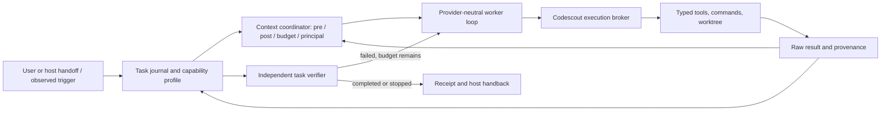

# Codescout deep agent — context and autonomous workflow integration

**Status: design exploration, 18 September 2026.** The intended product can execute selected work: investigate an observation, call tools in sequence, run a test or probe, edit an isolated workspace, verify a fix, and hand back a result. It also chooses relevant project context at the point where that context can affect the next action. The deep-agent runtime should be lightweight and provider-neutral: a local model (a Qwen-family deployment is one example) is preferred where it meets the task, while an external LLM API is also possible when explicitly configured for the project's data and capability policy. A main host assistant may supply a goal, receive progress, or handle a scope change; it is not the mandatory executor or a required cloud dependency.

The earlier [evidence review](../research/2026-09-18-local-semantic-evaluator-review.md) and [teammate feedback](typesafe-jev-report-feedback.md) correctly caution against treating semantic scores as truth. Their advisory ceiling was an interpretation of the product scope and is superseded here. The bounded Jev-like typed-question pattern may help select a workflow, evidence, or next action; substantive work needs a tool-using provider or a registered executable workflow, a deterministic runtime, and verifiable state transitions. This document proposes their integration. It does not claim a model has been selected, benchmarked, or deployed, nor authorize this session to run a repair.

## Observation period before implementation

**Decision, 18 September 2026:** measure current usage and collect ordinary positive, negative, mixed and unknown cases for 1–2 weeks before implementation. The [baseline](../research/2026-09-18-deep-agent-observation-baseline.md) records the UTC window, query, instrument coverage and historical seed evidence. New [context observations](deep-agent-context-observations.md) and [workflow observations with session coverage](deep-agent-workflow-observations.md) preserve decision-time inputs separately from later outcomes. The coordinating-session rules are in the project CLAUDE.md. Review collection quality on 25 September and stop routine capture at 00:00 UTC on 2 October unless explicitly extended. Implementation and model evaluation remain deferred; elapsed time alone does not make these cases training-ready.

## Amendment — 20 September 2026: the boundary is noticing, not cost

**This is an amendment to a live draft, not a correction of an error.** Everything below this section stands as written on 18 September. Two of its premises have since been falsified, both in the direction that makes the problem easier, and one of its sequencing conclusions inverts on evidence that did not exist when it was written. Where a specific claim is now false it carries a dated note in place; nothing has been deleted. Every figure in this section was re-verified at HEAD `170eac15` on 2026-09-20T13:17Z.

### Two stale premises

**Tool arguments are already recorded.** *Learning material and evaluation* cites the 2026-08-15 investigation's caveat that normal usage data lacked input arguments, and treats the trajectory corpus as something still to be captured. `UsageRecorder/write_content` (`src/usage/mod.rs`) persists `input_json` and `output_json` whenever debug capture is enabled, and the [baseline](../research/2026-09-18-deep-agent-observation-baseline.md) measured both present on **25,435 of 26,052 calls (97.63%)** over 2026-09-04 to 2026-09-17. The August caveat was true in August. What the corpus still lacks is not arguments but ordering, principal and outcome — see *Four measured blockers* below.

**A local in-process inference runtime is already a shipped default.** The open decisions in *Progression and open choices* include local-versus-API provider and in-process-versus-sidecar. `LocalEmbedder` (`crates/codescout-embed/src/local.rs`) runs ONNX in process, and `local-embed` has been in `default` since 2026-09-17 (`Cargo.toml`), the default model `local:AllMiniLML6V2Q` producing 384-dimension vectors. This closes neither decision — an embedder is not a tool-using worker — but it moves their starting point from "choose and deploy a runtime" to "decide what, if anything, the shipped one cannot do."

### The reframe

The Jev-style framing this design inherited is a **cost** boundary: a cheap model makes constant small judgements while an expensive one makes deliberate large ones. Nothing measured on codescout supports drawing the boundary there. No evidence in the baseline says good judgements are too expensive to make.

What the evidence does say is that decision points are **not recognised as decision points**. The observation window declared in CLAUDE.md opened 2026-09-18 to capture exactly the cases this design needs. On 2026-09-20, at HEAD `170eac15`, its ledgers held one `DWF`, one `DCS` and one `DCTX` — every one a historical seed or a setup row, and **zero prospective samples in two days** — on a checkout that routinely carries several concurrent sessions, while the recorder took 26,052 calls over the preceding 14-day window requiring nobody to remember anything. Filed as [`docs/issues/2026-09-20-observation-window-yields-zero-prospective-samples.md`](../issues/2026-09-20-observation-window-yields-zero-prospective-samples.md) (`0ca7439866e8f2b6`, cluster `declared-not-wired`, citing `OB-7`).

Three consequences follow, and they are the content of this amendment rather than its framing:

1. **The subsystem belongs at the server call boundary, not in the agent's prompt.** A prompt-resident rule is what CLAUDE.md already is, and the window is the counterexample to expecting one to fire.
2. **The primary metric is recall over eligible moments** — not accuracy, not cost. A judge that is correct whenever consulted and is never consulted scores zero on the thing that matters.
3. **The first version needs no model at all**, and that is a property to want rather than a compromise: the deterministic version is what generates the labelled corpus a learned version would need.

**This inverts the sequencing in *Mission and the decision boundary*,** which says to add a lightweight classifier only once measured trajectories expose a repeatable routing bottleneck. The revision is that the eligibility layer is the product and the tool-using worker is the later, harder, optional rung. The evidence for the inversion is two days old and did not exist on 18 September, so this supersedes that sentence rather than disputing its reasoning.

### The ladder

Four rungs. Each is independently useful, each produces what the next one needs, and only the fourth contains a learned model.

**Rung 0 — derive the corpus rather than collect it by hand.** A read-only query over `usage.db` reconstructs per-session call sequences with their arguments and results. One bound must travel with every number derived this way: `usage.db` records MCP calls only, so native `Bash`, `Read` and `Edit`, host prompts, and task outcomes are invisible to it. The hand-written `DCTX`/`DWF` entries then stop being the dataset and become adjudication labels for cases the query surfaces — fewer entries, each worth more.

**Rung 1 — a deterministic pre-call engine, containing no model.** `EngineDecl` (`src/engines/mod.rs`, lines 123-160 at this HEAD) carries `emit_post` and **no** `emit_pre`; `run_post_in` (`src/engines/coordinator.rs`, 119-151) runs post-only, one claim per `Corpus`, registry order as delivery precedence. Adding a pre phase is an explicit extension of the [coordination draft](../superpowers/specs/2026-09-02-retrieval-engine-coordination-design.md) (`0021bead4e5a01e2`), which this document already names as the owner of that surface — it must not become a second, competing dispatcher. Candidate predicates, all computable from session call history with no inference: a third `read_file` on the same markdown path (the reader is thrashing a heading map); a `grep` returning zero matches whose pattern contains a path separator (probable wrong scope); a call sequence matching a registered workflow's trigger prefix; and *this moment is an eligible observation point* → write the `DCTX` entry. That last is self-demonstrating and is the one to build first: the first workflow the system automates would be the observation window that was meant to produce its own training data.

**Rung 2 — a typed judgement interface with a mandatory fallback.** Only here does a judge appear, behind one narrow interface: the `bool` / `score` / `choice` shape, first-party, one call site. The governing rule inverts the vendor framing — **every judgement site must declare its behaviour when the judge is unavailable, slow, or low-confidence, and a site that cannot name its fallback does not get a judge.** The fallback is the product; the model is the optimisation. This is also the mechanism by which this document's own warning, that a semantic score must never confer authority, stays enforced rather than merely stated.

**Rung 3 — a learned head on an embedding already being computed.** Not a local generative model: a 384-dimension MiniLM embedding plus a classifier head measured in kilobytes (logistic regression or a small MLP), trained offline from rung 0's corpus, in process, with no sidecar, no gRPC and no network. Weights at that size are git-versionable, diffable and revertible, which a multi-gigabyte checkpoint is not. **The uncertainty here is real and should not be smoothed over:** the runtime is verified, but whether a frozen general-purpose sentence encoder separates codescout's decision classes is not, and rung 0's corpus can answer that before any of this is built. If it does not separate them, rung 3 is where this design stops and rungs 0 through 2 still stand.

### Token cost, with its denominator

Two levers, each with an existing measurement rather than an estimate.

**Guide injection.** Auto-injection fires on deterministic `owns_key` predicates. Observed in a single session on 2026-09-20, so a case and not a rate: roughly 3,600 tokens delivered (`project-activation-bootstrap`, `progressive-disclosure`, `symbol-navigation`, and three `librarian` sections), of which `progressive-disclosure` was used repeatedly and `symbol-navigation`'s per-language table was not used at all. The classifier's task is to predict **use**, not to match a key. The counterfactual is derivable offline with no new instrumentation, because `GuideLedger` already records delivery: replay a session's call sequence and ask whether an injected section's content is reflected in any later call. That signal is weak per instance, and the available sample is thousands of sessions.

**Overflow.** The baseline recorded **1,926 of 26,052 calls (7.39%)** overflowing, each returning a summary and often provoking a follow-up call. Choosing which slice of a buffered result to inline is a bounded `choice` judgement whose cost is counted in round trips rather than estimated.

### Four measured blockers under rung 0

All four filed 2026-09-20, all `open` at the time of writing.

| bug | id | what it blocks |
|---|---|---|
| `called_at` holds the completion instant at second resolution | `e75093da225ba1ce` | a session's calls cannot be ordered — `run_command`'s p95 is 43,055 ms, long enough that a call which started first is recorded last |
| `usage.db` records `session_id` but never `agent_id` | `90d32f37ef2d8fc8` | a subagent is indistinguishable from its parent, so per-principal analysis silently merges them |
| `run_command` never overrides `is_write` | `1fc9a6192a3f31b3` | the highest-volume tool records every shell command as a read |
| the observation window yields zero prospective samples | `0ca7439866e8f2b6` | the collection policy itself |

The first two are the ones rung 0 actually needs, and both are small. For the principal: the agent id is resolved by `principal_from_arguments` (`src/server.rs:1269`), consumed at `adopt_request_conversation` (`:1334`), then discarded before `UsageRecorder::new` (`:1352`) — the value is in scope and dropped twice rather than absent. Those line numbers were read at HEAD `170eac15`; both bugs were fixed the same day in `1dd363eb` and `ae1554f1` and are now archived, which re-keyed their ids (`id = sha256(abs_path)`) — the two cited above are the post-archive ones. Treat the archived bug files as authoritative, and note the principal file's own root-cause statement was found too strong once the fix was attempted: the composed `<session>/<agent>` stamp already reached the database in the `cc_session_id` slot, so the defect was a conflation rather than an absence. The third is deliberately **not** bundled with the other two: changing `is_write` alters what the server's write guard engages on, which is a behaviour change with blast radius rather than an instrumentation fix.

### What is deliberately not proposed

Recorded so a later reader does not re-litigate it. No planner/critic hierarchy, no message bus, no second tool path — this document already reaches the single-worker-loop conclusion from a different direction, and nothing here disturbs it. Rungs 0 through 2 are read-and-advise only. The `TaskEnvelope`, capability-profile and execution-broker machinery specified in *Event, decision, and state contracts* remains the right shape for autonomous execution; it is a later wall, to be built when a workflow has earned it rather than in advance of one.

### Future work

- Add `emit_pre` to `EngineDecl` as an explicit extension of the coordination draft, never as a parallel dispatcher.
- Write the rung-0 derivation query over `usage.db`, and publish its MCP-only bound in the same place as any number it produces.
- Decide the `Read` hole: native reads never reach `usage.db`. A routing change that would force shell and file mutation through codescout is in flight in the companion-plugin repository, with native `Read` left open for images and PDFs; that leaves image reads as the accepted residual gap.
- Measure guide-injection use offline against `GuideLedger` delivery records.
- Test class separability under the frozen encoder before committing to rung 3.
- Revisit at the 2026-09-25 observation-window review, which on today's evidence would convene over a single historical seed.

## Mission and the decision boundary

The user outcome is a completed, reviewable task, not a high-confidence label. For an eligible task, the runtime should gather the right evidence, choose a permitted next action, observe its result, revise its plan, and stop on a task-specific completion condition. Context is part of that causal loop: a source excerpt is useful when it changes the next tool call, probe, patch, or verification choice. It can also be delivered to the host assistant at a call boundary, so the host and local worker share a legible account of what happened.

Three execution shapes need comparison rather than premature collapse. **Rules and registered workflows** can execute a known sequence when the trigger, probes, and repair slots are explicit; this is best for exact path, schema, cap, or error-shape predicates. **One tool-using model in a durable loop** can explore unfamiliar code and synthesize a patch, provided a controller checks every action and terminal claim. **A controller plus a learned router and separate worker** could later save model calls or improve routing, but adds an extra model and calibration surface. The recommended first architecture is the *single-worker loop* with deterministic registered workflows where they already fit. Add a separate lightweight classifier only if measured trajectories expose a repeatable routing bottleneck. **Amended 2026-09-20 — this sequencing is superseded; see *Amendment — 20 September 2026*.** The measurement that prompted the revision is that eligible moments are not being recognised at all, which makes a deterministic eligibility layer the first rung and the worker loop a later one. The judgement in the next sentence is unaffected and still holds. A scorer alone cannot invent a novel patch or conduct a multi-step experiment. No checkpoint, provider, or hardware target is selected. Tool calling and structured output are feasible mechanisms in [llama.cpp's function-calling documentation](https://github.com/ggml-org/llama.cpp/blob/master/docs/function-calling.md), its [server documentation](https://github.com/ggml-org/llama.cpp/blob/master/tools/server/README.md), and [Qwen-Agent's function-call documentation](https://github.com/QwenLM/Qwen3/blob/main/docs/source/framework/function_call.md); support depends on model/template/provider and says nothing about quality or resource fit on codescout's tasks.

The controller, rather than the model, owns authority and time: task scheduling, capability checks, tool schemas, workspace pinning, cancellation, retry limits, durable journal, context budget, and terminal checks. The worker may propose the next tool call, inspect the raw result, form rival hypotheses, add a discriminating test, patch, and retest. This is real execution inside a preauthorized task profile, independent of whether inference is local or via an approved API. A run can complete without a new human turn when that profile permits its actions and independent completion evidence is observed. A changed objective or a capability outside the profile is a scope change that returns to the user or host for a decision; no repeated approval is required for each allowed step.

## Integration with codescout's existing surfaces

The table separates source read in this investigation from a draft spec and from this proposal. “Shipped” describes inspected implementation or the cited accepted ADR, not a new live runtime probe.

| Concern | Exists in codescout | Planned elsewhere | Proposed extension here |
|---|---|---|---|
| Timely context | `ENGINES`/`EngineDecl` register session-opener, guide-sections, operator-rules, and unmanaged craft-skills; `run_post_in` delivers post-result emissions ([engine registry](../../src/engines/mod.rs), [coordinator](../../src/engines/coordinator.rs)). `Tool::call_content` and [emitters](../../src/engines/emitters.rs) select result-aware guide sections. | The [retrieval coordination draft](../superpowers/specs/2026-09-02-retrieval-engine-coordination-design.md), Layer 2, designs total pre/post coordination, one byte budget, preview, and operator surface. The inspected coordinator currently has post dispatch, not that total pre phase. | A declared local-control engine submits context candidates and task events to the coordinator. The coordinator alone decides budget, corpus ownership, delivery, and suppression; no hidden cross-engine calls. Extending the draft's mostly-declined inter-engine communication needs an explicit revision to that spec. |
| Identity and delivery | The [principal ADR](../adrs/2026-09-14-a-subagent-is-a-principal.md) says composite `(session_id, agent_id)` identity shipped; server strips the companion-injected key before tool deserialization. `GuideLedger` records per-principal delivery. [Context log W-3](context-injection-session-log.md) measured a specific parent redelivery improvement while child delivery remained available. Guide delivery helpers were extracted in [guide_emit](../../src/tools/core/guide_emit.rs); [GG-9](resume-get-guide-section-grain-phases-2-3.md) is stale on that prerequisite. | Nested agents and resumption behavior beyond the measured case are not established. | Principal-keyed pending context and delivery receipts, distinct from run authority and workflow state. A fork aliasing parent gets the ADR's shared-window behavior. Anonymous identity degrades to session-grain delivery; it cannot promise child isolation. |
| Execution | [Server dispatch](../../src/server.rs) determines write behavior, checks access, acquires a write guard, and races calls with cancellation. [Tool contracts](../../src/tools/core/types.rs) define schemas and `is_write`. [Librarian gather](../../src/librarian/tools/gather.rs), [refresh](../../src/librarian/tools/refresh.rs), and [event creation](../../src/librarian/tools/event_create.rs) already produce bounded evidence and linked events. Gather returns context; it does not schedule work or grant permission. | No inspected end-to-end autonomous runner, scheduler, durable run journal, or model-controlled tool loop. | A controller issues ordinary codescout calls through a separate execution broker, persists before/after receipts, and resumes a bounded run. Catalog events can link task intent and evidence, but a dedicated durable workflow journal is required: an event transaction cannot make an arbitrary shell command or patch atomic. |
| Isolation and inspection | [Worktree artifact writes](../../src/librarian/tools/worktree.rs) can fork a main-checkout artifact into a shadow. [Legibility scan](../../src/librarian/tools/legibility_scan/mod.rs) has dry-run selection and full-set reconciliation. | The coordination draft proposes preview and dashboard view; it is not evidence of a shipped workflow inspector. | Isolated code/doc workspaces, a run preview, state/event trace, cancel/pause/resume, and a replay mode. Merge or publish remains a separately scoped capability. |

The [operator-rules engine spec](../superpowers/specs/2026-08-27-operator-rules-engine-design.md) describes always-resident and triggered rules. Deep-agent context should use those declared surfaces rather than create an unrelated prompt source. An operator rule that must hold before a call is a deterministic precondition; a learned relevance score can choose optional supporting context. The deferred [heuristic code-analysis design](heuristic-code-analysis-2026-04.md) also favors ranking and not duplicating linting. That remains a useful constraint on what the learned part should do, not a reason to stop at suggestions.

The MCP server observes codescout requests and results. It does not automatically see every host user prompt, private reasoning step, native tool, or task completion. A run therefore needs an explicit handoff with start, status, and cancel operations from the host or user, a declared schedule, or an opt-in companion/harness event adapter. A watcher may react only to events it actually captures. A missed event is unobserved coverage, not a `NoOp` training label. With no host connector, the local worker still runs registered tasks and writes its own progress/journal; queued host context waits for the next eligible codescout call or task boundary. Asynchronous progress reporting cannot assume it can wake the host on demand.

There are two viable implementation routes for the deep-agent loop. A small native codescout runner can keep the execution and context contracts in one place. A thin sidecar adapter to a framework such as [Deep Agents](https://github.com/langchain-ai/deepagents/blob/main/README.md) offers planning, filesystem, and context machinery, but its [architecture](https://github.com/langchain-ai/deepagents/blob/main/libs/ARCHITECTURE.md) brings another dependency and overlapping file/memory/tool abstractions. Neither framework name is a product requirement. In either route, codescout's broker, journal, principal, context coordinator, and terminal verifier remain authoritative; an adapter must not create an unobserved second tool path. Choose after measuring integration cost and whether the native loop lacks a needed capability.

## Event, decision, and state contracts

**Proposed `TaskEnvelope`.** A run starts with an objective and task class; requesting principal and optional host handback principal; workspace root, base revision, target paths; capability profile and expiry; provider/data policy; cancellation token; budgets for elapsed time, worker turns, tool calls, model input/output, test cost and retry attempts; and a task-specific terminal oracle. The runtime snapshots source revisions and records the exact evidence initially available. Capabilities name actions, not model confidence: read/search, targeted commands and tests (which may write files), isolated patch, artifact update, main-checkout apply, commit, network/publish, and communication are distinct classes. An allowed command still passes the tool's normal schema, sandbox, and access checks. The controller owns enforcement; a host assistant supplies the envelope or receives it but does not stand in for the gate. Provider policy states local or external API, approved endpoint/account, private-code egress class, model/version, retention, and fallback. Failure cannot silently switch from local to hosted inference or between API accounts; a declared fallback is a recorded new provider transition under the same task policy.

**Proposed `ObservationEvent`.** Each step records event time and phase (`task_start`, `before_call`, `after_result`, `after_error`, `after_test`, `before_patch`, `resume`, `terminal`); run and principal IDs; provider/model/policy version; tool name, typed arguments, effect class, and raw result reference; failure kind, recovery hint, cancellation, truncation, and output-buffer ID; workspace/head/file hashes; candidate evidence IDs and revisions; ledger delivery state; and run checkpoint. Preserve raw arguments/results with access controls and hashes, rather than a model-only summary. Redaction and retention policy must be explicit because private code can enter the record or leave through an approved API. Eligible *observed* trigger windows where no injection or worker action occurred are also events for later evaluation; absence from a historical usage log is not automatically a negative example.

An `@cmd` or `@tool` buffer handle is process-local and cannot by itself resume a run after server restart. Before releasing a transient buffer, the journal must materialize the bounded, redacted evidence needed for continuation into a durable local blob, store its hash and truncation status, and link the step to that blob. After compaction or restart, context is rebuilt from this manifest and the current workspace revision, not from the model's remembered prose or `GuideLedger` delivery state.

**Proposed `Decision` is one structured union**, not free-form text interpreted as authority: `NoOp(reason)`, `Defer(missing_evidence, next_check)`, `Inject(principal, packet_ids, phase, deadline)`, `StartWorker(task_id, workflow_id, capability_profile)`, `ResumeWorker(run_id, checkpoint)`, or `ReturnOrEscalate(recipient, result, scope_change)`. A worker's nested `NextAction` is a typed codescout tool call with expected revision and an evidence reference, or a terminal stop. The deterministic runtime and execution broker check action schema, phase, capability and execution budget; the context coordinator checks delivery budget and duplicate keys. The journal records the proposed/accepted/refused decision before any side effect. Model outputs may contain labels/rankings and cited spans; free-form rationale is optional for display, and never the terminal oracle.

The minimal deep-agent loop loads journal state and a bounded evidence packet; asks the configured provider for **one** typed action or stop; validates and dispatches that action; records the raw result; refreshes context for the next decision; and repeats until a terminal verifier passes or a stop condition fires. That loop can investigate, patch, test, diagnose failure, and retest without a planner/critic ensemble or training first. “Lightweight” means one worker loop, bounded context by stable evidence references rather than repeatedly copying whole documents, limited tools and turns, and no duplicate file/memory/tool stack. It is an operational design goal, not an unmeasured promise about latency, memory footprint, or model quality. If shadow trajectories later identify a costly recurring routing choice, a small typed classifier can be added in front of the worker.

The workflow journal stores `created → eligible → running → awaiting_result → verifying → completed`, with explicit `needs_evidence`, `needs_capability`, `stale`, `cancelled`, `failed_verified`, and `ambiguous_effect` exits. A registered recipe pins allowed transitions; a novel worker may choose actions within the profile but cannot skip the independent terminal predicate. Before each effect, persist intent, capability and expected revision; after it, persist the exact response, observed target state and verifier result. The delivery ledger answers “was context emitted to this principal?”; the journal answers “what effect was attempted and observed?”; the authorization record answers “was it allowed?”; the verifier answers “did it meet the objective?” These are separate facts. “read or injected,” “used,” and “verified” must never be collapsed into one success stamp.

Retries require care. A key such as `(run_id, step, target, expected_version)` can deduplicate controller requests, while a lease/fencing token serializes writes to one workspace target. Neither gives exactly-once effects for arbitrary shell commands, network requests, or processes that survive a lost response. If a call times out after a possible side effect, the controller enters `ambiguous_effect`, inspects target state and command artifacts, and reconciles before reissuing. Stale base hashes or a changed worktree head force resnapshot and replan; they do not authorize “try anyway.” Cancellation ends new actions and invokes existing process reaping where supported. A failed rollback is a terminal operator-visible condition, not another unconstrained repair loop. Do not dispatch inference recursively while holding `GuideLedger`, catalog, or write locks; compute candidate decisions outside those critical sections and revalidate before the effect.

The existing `Tool::is_write` and server write guard are useful but incomplete effect controls. In inspected source, `RunCommand` accepts a shell command without its own `is_write` override; a shell command classified as a read may still modify files or launch processes. The autonomous broker therefore needs separate command classes, worktree sandboxing, time/output limits, declared targets, and post-command state inspection. A model, local or hosted, cannot turn a command into a safe read by naming it one. Normal codescout access rules remain in force, but the initial worker profile must constrain shell effects explicitly.

## Timing: context when it can matter

“Just in time” is a causal deadline, not simply a small number of milliseconds. A packet needed to choose the current call must arrive before that call; a packet selected from a tool's actual result can only influence the next step. Today the server's [call boundary](../../src/server.rs) can normalize tool arguments and principal before execution, but the inspected [coordinator](../../src/engines/coordinator.rs) only runs post emitters. The draft coordination spec locates a future total pre dispatcher at the server. Such a dispatcher could return `Proceed`, `Advise`, or `BlockAndReissue` before write locking. A post-result “block” would be false assurance after the side effect. A blocked attempt needs its own receipt because the ordinary executed-call record will not exist.

For a host assistant, `BlockAndReissue` only guarantees delivery before the attempted call if its adapter can surface that packet and let the host reissue. It does not prove the host read or obeyed it, and it does not grant permission. Plain MCP does not promise an arbitrary unsolicited interruption while the host is thinking. Adapters should declare whether they support pre-call pause/reissue, post-result injection, and queued-on-next-call/task context. Where a required packet cannot be shown before an effect, the runtime blocks only a policy-relevant operation or queues it for a later safe boundary; a late packet cannot retroactively inform an earlier action. The local worker's own loop can pause before its next action and consume the packet directly, which makes selected local workflows independent of host injection timing.

Optional semantic selection should not put a model call on every synchronous tool path. Deterministic event eligibility and coalescing choose which moments deserve inference; revision-bound evidence packets can be cached. A deadline decision uses an already-ready packet or a declared fallback, while deeper investigation can queue into a worker run. Measure model time separately from tool time. If optional inference is unavailable, ordinary tool execution continues with deterministic context selection; a separately declared, required precondition still enforces its own block. This preserves useful just-in-time delivery without turning every codescout call into an opaque latency dependency.

Post-result selection should use the actual response topic, candidate records, warnings, and truncation status. The [retrieval benchmark](retrieval-benchmark.md) shows why: code-only filtering, title-bearing chunks, and per-artifact diversity changed historical results before any new judge was applied; a dated historical [reranker A/B](../issues/archive/2026-07-28-reranker-costs-42x-latency-and-lowers-score.md) helped four cases and hurt five while adding latency under its configuration. A learned selector can rank candidate evidence for the current task, but it cannot recover absent vectors or a missing chunk. Deterministic coordinator policy owns the total byte budget, corpus ownership, and compact citation-first disclosure. The selected packet records what was omitted as well as what was delivered. Deduplication includes principal, question/version, evidence revision, and task epoch, so a changed result can be relevant again; compaction may rearm context delivery but must not rerun completed effects.

## Worked run traces

**Trace A — autonomous investigation of a wrong-sign conclusion.** An incident report cites an audit-reference experiment and claims it confirms hypothesis A; [R-101](reconnaissance-patterns.md) records a historical instance where the observation actually ruled that hypothesis out. A preauthorized investigation envelope permits source reads and one bounded reproduction; a report update is scoped to an isolated workspace. At `task_start`, retrieval brings the experiment's original statement, current test input and result, and a rival hypothesis into a versioned packet. The worker records predictions for A and B *before* re-running the probe, executes it, and compares the observed output with both. If the rival prediction was absent or the probe cannot discriminate, the run stops `needs_evidence` and hands back the missing test. If the experiment defines an explicit, executable expected-output predicate, a contradictory observed sign can justify a bounded correction of that stated observation, followed by a fresh machine check and diff review. For an arbitrary causal conclusion, the worker hands back a diagnostic and candidate wording as unresolved; rereading its own prose is not independent semantic verification. The receipt links the predictions, probe, and source revisions without claiming an ultimate root cause.

**Trace B — autonomous documentation-reference repair.** An `audit_doc_refs` finding names an apparent missing path in onboarding prose. [U-17](codescout-usage-frictions.md) shows that instructional placeholders and reader-side `.github` paths historically produced false positives, while real drift also exists. A selected `docs-repair` profile allows read, exact auditor/probe commands, and isolated edits only in the cited documentation or a narrow auditor rule. The context packet carries the parsed reference kind, exact prose span, resolver trace, related path, and repository head; it excludes the later tracker diagnosis as input. The worker first runs the deterministic resolver. If the link truly targets a renamed repo file, it updates the citation; if the text describes a reader-side path, it may add precise scope wording or a narrow parser exclusion. It reruns the same audit and a real broken-link control. Success requires the original finding to resolve *and* the control to remain detectable; an overbroad suppression fails verification and leaves the patch for review or rollback according to the profile. The host receives the before/after diff, audit output, and the unresolved case if intent could not be established. The model did substantive interpretation and editing, while the parser and controls supplied the oracle.

**Trace C — autonomous test and code fix in an isolated worktree.** A fresh integration check shows the IL3 deny hook is not invoked, resembling the historical [U-30/U-33](codescout-usage-frictions.md) and [H-1](codescout-usage-hookify.md) records. The trigger is the *current failing check*, not the old tracker status. An authorized `guard-repair` run pins a worktree and revision, reads hook registration and implementation symbols, and injects the script-internal-pipeline and legitimate-content-filter neighbors at the `before_patch` phase. The worker first reproduces the missing deny behavior with a positive control, writes a regression test for it and allowed neighboring commands, then patches the registration or parser as the evidence dictates. It runs the narrow tests, an integration check through the actual hook path, and the project-required gate appropriate to that change. If the prohibited action still executes when the expected rejection should occur, or a legitimate neighbor becomes blocked, verification fails; one bounded repair attempt may follow, then the run stops with its worktree and trace. If all checks pass, the controller records the diff, test commands/results, remaining limitations, and a handback receipt. Applying or merging into the shared checkout depends on the profile's separately granted capability; a successful isolated run does not silently merge itself.

These traces show different context deadlines. Trace A needs rival predictions before the probe, then the result before its conclusion. Trace B needs resolver scope before editing and control results after. Trace C needs legitimate neighbor cases before patching, then test failures before the next repair. Each trace uses the same journal, capability gate, and handback contract without pretending one classifier can generate all three workflows.

## Learning material and evaluation

The historical trackers are a case-discovery archive, not demonstrations ready for training. [PR-review `pr-review-session-log:F-3`, `pr-review-session-log:F-4`, and `pr-review-session-log:W-3`](pr-review-session-log.md) separate an initial review, independent command/probe execution, and later repair. [Fable SR-8/SR-9](2026-09-01-fable-system-review.md) warns that recurrence was not measured at that review date and related models can share bias. A trajectory needs a frozen event prefix before a decision, exact available evidence, tool arguments/results, patch/diff, independent terminal outcome, and a recorded non-trigger window. Later issue titles, root-cause prose, fixes, archive status, and link edges belong to outcome/provenance, not the model's input. An absent action in old logs is not a negative label: the [dated tool-usage investigation's Method caveats](2026-08-15-tool-usage-investigation.md) says normal usage data lacked input arguments, and unobserved host-native steps are a separate coverage gap. **Amended 2026-09-20:** the input-argument half of that caveat was true at its date and is no longer true of the present corpus — `UsageRecorder/write_content` (`src/usage/mod.rs`) persists `input_json` and `output_json` under debug capture, measured present on 25,435 of 26,052 calls (97.63%) in the 2026-09-04 to 2026-09-17 baseline. Arguments and results are largely already recorded; ordering, principal and outcome are what the trajectory still lacks. The host-native coverage gap stands unchanged. See *Amendment — 20 September 2026*. Group copies, revisions, linked postmortems, work streams, and shared author/model lineage; split forward in time. Preserve disputed and failed cases rather than self-labeling success from a green author test or a status field. No automatic online fine-tuning should convert the worker's own completion claim into truth.

Evaluation needs four separable questions. **Retrieval:** did the frozen packet contain the relevant source and passage? **Timing:** did the right principal receive it before the action it could change, at a reasonable context cost? **Worker:** with the same packet and capability profile, did it execute legal, effective steps and meet an independent oracle? **Full loop:** did the integrated system finish more useful tasks with acceptable cost and harm? Run incumbent deterministic workflow, context-only, worker-only, and combined arms at matched tool/token/time budgets, then ablate pre versus post timing and source groups. For worktree repair, measure observed pre-fix failure and post-fix relevant tests, unnecessary diffs, rollback failures, repeated tool calls, wasted investigations, duplicate work with the host, handback burden, and recovery after interruption. Count eligible no-trigger windows so “more injections” cannot masquerade as improved timing. Test positive controls that fire, negative controls that remove the binding capability, and noise controls that expose order or style effects. Historical reranking scores and vendor latency claims are context, not performance estimates for this controller.

## Progression and open choices

The proposed path has concrete work at each stage. First, document the task envelope, provider/data policy, capability classes, event and decision schemas, terminal oracles, and a small case set from time-frozen incidents. The guide helper extraction marked as step 0 in [GG-9](resume-get-guide-section-grain-phases-2-3.md) was subsequently completed; do not reopen it as a prerequisite. Second, implement coordinator-owned pre/post budget and preview as an explicit extension of the [coordination draft](../superpowers/specs/2026-09-02-retrieval-engine-coordination-design.md), plus explicit task handoff, a durable run journal separate from `GuideLedger` and catalog events, and a single provider-neutral worker loop. Third, shadow action proposals and context decisions, then replay them against frozen results and disposable worktrees with cancellation, stale-revision, ambiguous-effect, illegal-action, and external-provider egress controls. Fourth, run one bounded **substantive** profile—reproduce, patch, test, repair, retest in an isolated workspace—only when its task oracle, operator preview, rollback, and handback are credible. The same profile can compare configured local and API providers without changing tools, authority, evidence packet, or verifier. Expand task classes by evidence of completed work, not by model confidence or the number of contexts emitted.

The operator needs to see why an event was selected or suppressed, which principal got which packet, current run phase, proposed/refused tool calls, raw-result references, remaining budget, and whether a terminal predicate fired. Preview/simulate should show the planned injection and potential action without consuming the ledger or executing effects. Pause, cancel, replay, and resume must show whether an effect is merely attempted, observed, ambiguous, or verified. A controller checkpoint can help resume a thread—[LangGraph's persistence documentation](https://docs.langchain.com/oss/python/langgraph/persistence) illustrates that general mechanism—but codescout should choose its own journal semantics and not infer exactly-once side effects from checkpointing.

Open design decisions are the first eligible workflow and its oracle; local versus explicitly approved API provider per project; whether a native loop or thin framework adapter is less costly; model ownership level (open weights, local fine-tuning, or from-scratch training); in-process versus local sidecar; privacy/retention for captured code and tool results; adapter capability for pre-call pause; and which apply/commit capabilities a user has preauthorized. **Amended 2026-09-20:** two of these now start from a different place rather than from nothing. `LocalEmbedder` (`crates/codescout-embed/src/local.rs`) runs ONNX in process and `local-embed` has been in `default` since 2026-09-17, so a local in-process runtime is a shipped default rather than a thing to procure; the local-versus-API and in-process-versus-sidecar decisions remain open for a tool-using worker, which an embedder is not. See *Amendment — 20 September 2026*. These decisions need measured task quality, actual hardware behavior, and operator needs. The immediate design claim is narrower: codescout has real seams for context and typed execution, and a provider-neutral controller can be specified to connect them. Whether that connection completes tasks better remains to be demonstrated.
